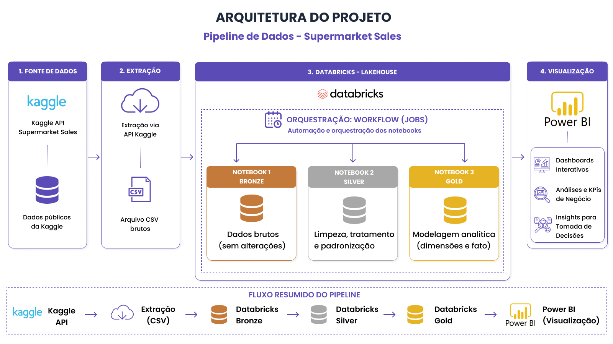
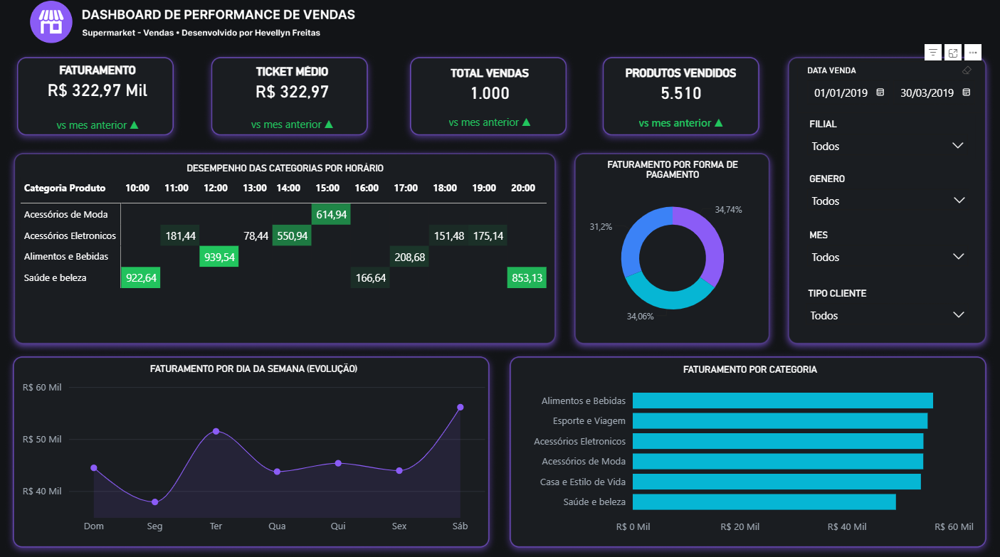

# Pipeline de Dados End-to-End: Supermarket Sales (Arquitetura Medallion)

Este projeto implementa um pipeline de dados automatizado e robusto utilizando a *plataforma Databricks (Lakehouse)* para extrair, processar, limpar e modelar dados de vendas de supermercados provenientes da API do Kaggle, preparando-os para o consumo de Business Intelligence no *Power BI*.

---

## Arquitetura do Projeto

Diagrama do fluxo de engenharia de dados do projeto.

---

## Visualização relatório Power BI

Relatório de análise de vendas.

O projeto foi construído seguindo um fluxo modular dividido em quatro etapas principais:

1. *Fonte de Dados:* Consumo de dados públicos de vendas de supermercados hospedados no Kaggle.
2. *Extração:* Conexão e download automatizado do arquivo CSV bruto via API do Kaggle.
3. *Databricks Lakehouse (Orquestração e Processamento):*
   * *Notebook 1 (Bronze):* Ingestão do dado bruto (formato Delta) sem nenhuma alteração para fins de histórico e auditoria.
   * *Notebook 2 (Silver):* Processamento em PySpark para limpeza de nulos, deduplicação, correção de tipos de dados e padronização das colunas.
   * *Notebook 3 (Gold):* Modelagem analítica (Star Schema) criando tabelas de dimensões e fatos otimizadas para performance.
   * *Orquestração (Workflows/Jobs):* Configuração de um pipeline agendado e automatizado para executar os notebooks de forma sequencial e monitorada.
4. *Visualização:* Conexão das tabelas Gold com o Power BI para criação de dashboards interativos, análises de KPIs de negócio e insights para tomada de decisões estratégicas.

---

## Tecnologias Utilizadas

* *Linguagem Principal:* Python (PySpark) e SQL
* *Ambiente de Desenvolvimento:* Databricks Community / Enterprise
* *Engine de Processamento:* Apache Spark (Spark SQL & DataFrames)
* *Storage e Formato de Arquivos:* Delta Lake (Bronze, Silver, Gold)
* *Orquestrador:* Databricks Workflows (Jobs)
* *BI & Visualização:* Power BI Desktop

---

## Estrutura dos Notebooks (Databricks)

### 1. Bronze (Notebook_Bronze)
* *Objetivo:* Garantir a persistência do dado como ele foi recebido da API.
* *Ações:*
  * Autenticação e requisição na API do Kaggle.
  * Download do arquivo CSV de vendas.
  * Gravação direta no repositório Delta como tabela Bronze.

### 2. Silver (Notebook_Silver)
* *Objetivo:* Garantir a qualidade e a confiabilidade dos dados.
* *Ações:*
  * Tratamento de valores nulos ou inválidos.
  * Deduplicação de registros de vendas.
  * Conversão e tipagem correta de dados (ex: datas, valores monetários, inteiros).
  * Padronização de nomes de colunas usando convenção de código (ex: snake_case).

### 3. Gold (Notebook_Gold)
* *Objetivo:* Modelagem dimensional voltada para performance em relatórios de negócios.
* *Ações:*
  * Separação dos dados em tabelas de *Dimensão* (ex: dim_clientes, dim_filiais, dim_produtos) e tabela *Fato* (fato_vendas).
  * Otimização das tabelas em formato Delta de alta performance.

---

## Como Executar este Projeto

1. *Configuração da API do Kaggle:*
   * Obtenha suas credenciais do Kaggle (kaggle.json).
   * Adicione as chaves de API com segurança utilizando o Databricks Secrets.
2. *Importação dos Notebooks:*
   * Importe os notebooks da pasta notebooks/ deste repositório para o seu workspace do Databricks.
3. *Configuração do Workflow:*
   * No Databricks, crie um novo *Job (Workflow)*.
   * Adicione três tarefas sequenciais conectando os Notebooks 1, 2 e 3.
4. *Conexão com o Power BI:*
   * Utilize o conector nativo do Azure Databricks no Power BI para buscar as tabelas da camada Gold.

---

## Autor
*Hevellyn Freitas*

LinkedIn: https://www.linkedin.com/in/hevellyn-freitas-a1b248254?utm_source=share_via&utm_content=profile&utm_medium=member_ios

GitHub: https://github.com/Hevellyn04